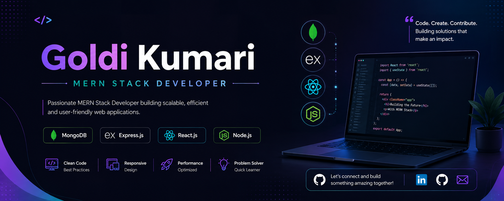

# 👋 Hi, I'm Goldi Kumari

<p align="center">
  
</p>

<p align="center">
  <b>MERN Stack Developer | Full Stack Web Developer | AI Enthusiast</b>
</p>

<p align="center">
  JavaScript • React • Node.js • Express.js • MongoDB • SQL • AI
</p>

---

## 👩‍💻 About Me

I'm **Goldi Kumari**, a **B.Tech Computer Science & Engineering student** and **MERN Stack Developer** passionate about building modern, responsive, and user-focused web applications.

I enjoy turning ideas into practical software solutions and continuously improving my development skills through real-world projects, problem solving, debugging, and learning new technologies.

- 🎓 B.Tech in Computer Science & Engineering
- 🏫 Oriental Institute of Science and Technology, Bhopal
- 📚 Diploma in Computer Science & Engineering
- 💻 MERN Stack Developer
- 🤖 Interested in AI-powered applications
- 🌐 Interested in Full Stack Web Development
- 🎨 Interested in responsive UI and Figma-to-code development
- 🧠 Practicing Data Structures, Algorithms and SQL
- 🚀 Interested in building practical and scalable applications

---

# 🛠️ Technical Skills

## 💻 Programming Languages

- JavaScript
- Java
- C
- C++
- HTML5
- CSS3
- SQL

---

## 🎨 Frontend Development

- React.js
- Vite
- Redux
- Context API
- React Router
- Tailwind CSS
- Bootstrap
- Responsive Web Design
- Figma to HTML/CSS/JavaScript

---

## ⚙️ Backend Development

- Node.js
- Express.js
- REST APIs
- API Integration
- Express Middleware
- Authentication
- JWT
- bcrypt
- Error Handling
- Backend Architecture

---

## 🗄️ Databases

- MongoDB
- MongoDB Atlas
- Mongoose
- MySQL
- PostgreSQL

---

## 🤖 AI & Generative AI

- Google Gemini / Generative AI
- Groq
- AI API Integration
- AI-powered Web Applications
- Resume Analysis
- Skill Extraction
- Career Prediction
- Skill Gap Analysis
- AI-generated Learning Roadmaps

---

## 🔐 Authentication & Security

- JWT Authentication
- Password Hashing
- bcrypt
- Protected Routes
- Authentication Middleware
- API Authorization

---

## 🔥 Cloud & Services

- Firebase Authentication
- Firebase Firestore
- Firebase Storage
- Cloudinary
- ImageKit

---

## 🔧 Tools & Platforms

- Git
- GitHub
- VS Code
- Postman
- Vercel
- Render
- Netlify
- Firebase

---

# 🚀 Featured Projects

## 🤖 AI Career Path Predictor & Skill Gap Analyzer

An AI-powered career guidance platform that analyzes a user's profile and skills to predict suitable career paths, identify missing skills, and generate personalized learning roadmaps.

### Features

- 📄 Resume Upload
- 📑 PDF Resume Parsing
- 🔍 Skill Extraction
- 🎯 Career Prediction
- 📊 Skill Gap Analysis
- 🤖 AI Career Suggestions
- 🗺️ Personalized Learning Roadmap
- 📚 Recommended Skills and Resources
- 👤 Profile Analysis

### Technology

```text
React
Node.js
Express.js
MongoDB
Gemini AI
Groq
REST APIs
